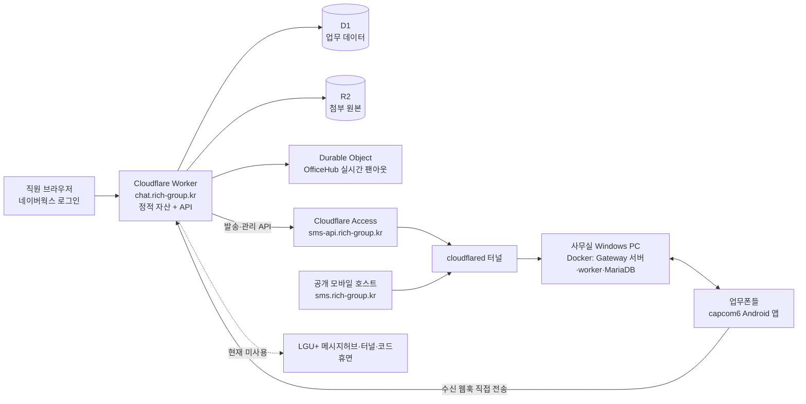

# RichChat 운영·인수인계

이 문서는 처음 인수받은 유지보수 개발자가 운영 상태를 확인하고, 정기 작업과
장애 대응을 수행하기 위한 진입점이다. 코드 수정·검증·배포 규칙은
[`AGENTS.md`](../AGENTS.md)가 정본이고, 스키마는 [`migrations/`](../migrations/)가
정본이다. 이 문서에는 실제 운영 절차만 둔다.

## 시스템 지도



수신 웹훅은 게이트웨이 서버를 거치지 않고 업무폰에서 Worker로 직접 간다.
`sms.rich-group.kr`은 업무폰의 `/api/mobile/v1` 접속용 공개 호스트이고,
`sms-api.rich-group.kr`은 Worker가 쓰는 `/api/3rdparty/v1` 관리 API 호스트로
Cloudflare Access 뒤에 있다. 두 호스트 모두 사무실 PC의 같은 게이트웨이
원본으로 이어진다.

LGU+ 수신·발신 코드, 시크릿, 테이블, `lgu-*` 터널은 삭제되지 않았지만 현재
휴면이다. 재개 또는 철거 판단은 [GitHub 이슈 #1](https://github.com/hoddukzoa12/RichChat/issues/1)을
먼저 확인한다.

| 구성요소 | 관리에 필요한 계정 종류 |
|---|---|
| Worker, D1, R2, Durable Object, DNS, Tunnel, Access | Cloudflare 계정과 해당 리소스 권한 |
| 소스·이슈·배포 브랜치 | GitHub 저장소 계정 |
| 사무실 PC, Docker Desktop, `cloudflared` 서비스 | Windows 관리자 계정과 Cloudflare Tunnel 자격 |
| Gateway 서버, 기기, 웹훅 | Android SMS Gateway 관리 계정(Basic 인증) |
| 업무폰 capcom6 앱 | 업무폰 잠금 계정과 Gateway 기기 등록 자격 |
| 직원 로그인 | 네이버웍스 조직 계정, Developer Console 앱, 조직 관리자 계정 |
| 휴면 LGU+ 경로 | LGU+ 메시지허브 프로젝트·관리자콘솔 계정 |

실제 계정명·비밀번호·토큰 값은 이 저장소에 적지 않는다. 바인딩 이름과 용도는
[`wrangler.jsonc`](../wrangler.jsonc)와 [`.dev.vars.example`](../.dev.vars.example)을
확인하고, 값은 인계받은 비밀 저장소에서 찾는다.

## 배포

배포 명령과 완료 기준은 [`AGENTS.md`의 “스택과 명령”](../AGENTS.md#스택과-명령)이
정본이다. 특히 **빌드 없이 배포하면 명령은 성공해도 지난 빌드의 코드와 설정이
조용히 다시 올라간다.** 배포 출력 첫 줄의 redirected Wrangler 설정 파일과
`env.*`를 매번 확인한다.

### 1. 마이그레이션을 코드보다 먼저 적용

잠긴 버전의 Wrangler를 사용하도록 의존성을 먼저 설치하고 적용 대기 목록을
확인한다.

```sh
npm ci
npx wrangler d1 migrations list richchat --remote
```

아래 행 수를 기록한다. 같은 SELECT를 마이그레이션 적용 직후 다시 실행해 전후가
같은지 비교한다.

```sh
npx wrangler d1 execute richchat --remote --command "SELECT 'conversations' AS table_name, COUNT(*) AS row_count FROM conversations UNION ALL SELECT 'messages', COUNT(*) FROM messages UNION ALL SELECT 'users', COUNT(*) FROM users;"
```

그다음 마이그레이션을 적용한다.

```sh
npx wrangler d1 migrations apply richchat --remote
```

다시 `migrations list`와 행 수 SELECT를 실행한다. 예상하지 않은 감소가 있으면
코드를 배포하지 말고 중단한다.

### 2. 시크릿 등록 또는 교체

필수 이름은 `wrangler.jsonc`의 `secrets.required`, 발급처와 장애 영향은
`.dev.vars.example`을 따른다. 예를 들어 네이버웍스 Client Secret을 넣을 때:

```sh
npx wrangler secret put WORKS_CLIENT_SECRET
npx wrangler secret list
```

시크릿 값은 입력 후 다시 읽을 수 없고 `secret list`에도 이름만 나온다. 입력
시점에 비밀 저장소에도 함께 기록한다. 값을 확인할 수 없으면 기존 값을 추측하지
말고 발급처에서 회전한 뒤 다시 넣는다.

### 3. 검증 후 빌드·배포

```sh
npm run check
npm run build && npx wrangler deploy
curl -fsS https://chat.rich-group.kr/api/health
```

`npm run check`가 실패하면 배포하지 않는다. 배포 시 `Using redirected Wrangler
configuration`이 `dist/richchat/wrangler.json`을 가리키는지, 출력된 변수와
호스트가 운영 값인지 확인한다.

## 정기 운영

이 절의 화면 경로는 데스크톱 운영 화면 기준이다. 사무소 설정은 관리자 권한으로
진입한다.

### 업무폰 추가

1. 왼쪽 **사무소** → **업무폰 · 문자 연동** → **＋ 업무폰 등록**을 연다.
2. **등록 코드 받기**를 누른다. 화면에 업무폰 접속 API URL과 6자리 일회용
   코드, 만료 시각이 표시된다.
3. 폰의 capcom6 앱에서 **Sign in by Code**를 열고 API URL과 코드를 입력한다.
4. 웹 화면의 **2. 감지된 업무폰**에서 기기를 선택한다. 자동 감지가 늦으면
   **기기 다시 찾기**를 누른다.
5. 하이픈 없는 전화번호와 운영자가 구별할 라벨을 입력해 **업무폰 등록**을
   누른다.
6. 등록된 폰 행에서 **서명키 발급**을 누르고 한 번만 표시되는 값을 복사한다.
7. 폰 앱 **Settings → Webhooks → Signing Key**에 붙여넣고 저장한다.
8. 폰으로 시험 문자를 받아 인박스에 해당 라벨·번호의 대화가 생기는지 확인한다.

**서명키 재발급**을 누르면 기존 키는 즉시 무효가 된다. 새 키를 폰 앱에 넣기
전까지 그 폰의 수신이 끊기므로, 폰을 손에 둔 상태에서만 재발급한다.

### 게이트웨이 웹훅 등록

게이트웨이 서버를 교체하거나 재설치하면 관리 API에서 아래 여섯 이벤트를 모두
같은 URL에 등록한다.

```text
sms:received
mms:received
mms:downloaded
sms:sent
sms:delivered
sms:failed
```

사무실 PC에서 PowerShell을 열고 로컬 원본에 `POST
/api/3rdparty/v1/webhooks`를 호출한다. 아래는 `sms:received` 등록 예시다.
나머지 다섯 이벤트도 `event`와 `id`를 각각 바꿔 같은 명령을 실행한다. `id`는
이벤트마다 달라야 한다.

```powershell
curl.exe -X POST "http://127.0.0.1:3000/api/3rdparty/v1/webhooks" -u "<계정아이디>:<계정비밀번호>" -H "Content-Type: application/json" -d '{"id":"richchat-sms-received","url":"https://chat.rich-group.kr/api/hooks/sms-gateway","event":"sms:received"}'
```

등록 후 SMS 한 건과 MMS 한 건을 수신하고, 답장 한 건을 보내 `sms:sent`까지
확인한다. `sms:delivered`는 수신자 통신사가 배달 리포트를 제공할 때만 온다.
서버 자체 설치·터널 복구는 [게이트웨이 서버 설치](./게이트웨이-서버-설치.md)를
따른다.

### 직원 초대와 역할

1. **사무소** → **직원 · 권한** → **＋ 초대**를 연다.
2. 이름, 직함, 네이버웍스 이메일, 역할을 입력하고 **초대하기**를 누른다.
3. 새 직원이 같은 이메일의 네이버웍스 계정으로 처음 로그인하면 상태가
   **초대 발송됨**에서 **활성**으로 바뀌는지 확인한다.
4. 이후 이름·직함·역할은 직원 행의 **수정**, 접근 중지는 **비활성화**로
   관리한다.

역할별 권한의 정본은 [`shared/permissions.ts`](../shared/permissions.ts)다.
관리자 역할의 지정·변경은 관리자만 할 수 있으며 자기 자신과 마지막 활성
관리자에는 보호 규칙이 적용된다.

### 발신 채널 관리

**사무소** → **업무폰 · 문자 연동**에서 라벨 수정, 비활성화·재활성화, 서명키
상태를 관리한다. 기본 발신번호는 이 화면에서 비활성화할 수 없다. 새 대화를
시작할 때는 **대화** → **＋ 새 메시지**에서 활성 상태인 **보내는 폰**을 고른다.
기존 대화의 답장은 그 대화에 연결된 업무폰으로 나간다.

LGU+ 대표번호는 현재 휴면 상태지만 이력 보존 때문에 행을 삭제하지 않는다.
재개·철거는 이슈 #1의 결정을 따른다.

## 장애 진단 런북

### “수신이 안 된다”

1. 먼저 실패 격리 기록을 본다.

   ```sh
   npx wrangler d1 execute richchat --remote --command "SELECT mo_key, error_text, attempts, datetime(last_at / 1000, 'unixepoch', '+9 hours') AS last_at_kst FROM mo_failures ORDER BY last_at DESC LIMIT 50;"
   ```

   같은 시각의 행이 있으면 `error_text`를 기준으로 페이로드, 서명, D1·R2 오류를
   고친다. 원문에는 개인정보가 있으므로 `raw_json`은 꼭 필요할 때만 별도로
   조회한다.

2. MMS라면 헤더만 받고 다운로드가 끝나지 않은 잔량을 확인한다.

   ```sh
   npx wrangler d1 execute richchat --remote --command "SELECT COUNT(*) AS pending_count, datetime(MIN(first_at) / 1000, 'unixepoch', '+9 hours') AS oldest_kst, datetime(MAX(last_at) / 1000, 'unixepoch', '+9 hours') AS newest_kst FROM sms_gateway_mms_pending;"
   ```

   `pending_count`가 계속 늘면 `mms:downloaded` 등록, 앱의 MMS 다운로드 권한과
   네트워크를 확인한다. `mms:received`와 `mms:downloaded`의 ID 관계를 임의로
   추측하지 말고 `AGENTS.md`의 Android SMS Gateway 제약을 따른다.

3. 재현하면서 Worker 요청 로그를 본다.

   ```sh
   npx wrangler tail richchat --format pretty --method POST
   ```

   `/api/hooks/sms-gateway` 요청이 보이면 HTTP 상태와 같은 시각의 로그를 따라간다.
   요청 자체가 없으면 Worker·D1 코드부터 고치지 않는다. 순서대로 발신자가
   RCS(채팅+)를 사용했는지, 폰 앱이 켜져 있고 네트워크·배터리 최적화 예외가
   정상인지, 해당 폰의 서명키가 사무소 화면에서 발급한 현재 키와 일치하는지
   확인한다. LGU+ 경로 신고라면 `AGENTS.md`의 “미해결: LG U+ 가입자의 SMS”에
   적힌 통신사·문자 길이 확인 순서를 그대로 따른다.

4. 사무실 PC에서 게이트웨이 자체 상태를 확인한다.

   ```powershell
   curl.exe http://127.0.0.1:3000/health
   docker compose -f C:\SmsGateway\docker-compose.yml ps
   ```

수신은 업무폰이 Worker에 직접 보내므로 게이트웨이 서버 장애와 수신 장애를
같은 것으로 취급하지 않는다.

### “발송이 실패로 뜬다” 또는 “발송됨에서 안 넘어간다”

먼저 최근 발송 상태와 서버가 보존한 원인을 확인한다.

```sh
npx wrangler d1 execute richchat --remote --command "SELECT id, client_key, msg_key, channel, delivery_status, result_code, error_text, datetime(created_at / 1000, 'unixepoch', '+9 hours') AS created_at_kst FROM messages WHERE direction = 'out' ORDER BY created_at DESC LIMIT 50;"
```

- `실패`면 `result_code`와 `error_text`가 첫 원인이다. `CONFIGURATION_ERROR`는
  `wrangler.jsonc`·`.dev.vars.example`의 Gateway/Access 바인딩을 확인하고,
  기기 오류는 폰의 전원·SIM·통신 상태를 확인한다.
- UI의 **발송됨**은 DB의 `전송중`이다. `result_code=Sent`이고 오류가 없으면
  폰이 통신사에 넘긴 상태다. 수신자 통신사가 배달 리포트를 주지 않으면 이것이
  사실상 최종 상태이며, 그 계약은 `AGENTS.md`의 Android SMS Gateway 절이
  정본이다.
- 모든 발송이 실패하면 사무실 PC에서 아래를 실행해 서버부터 확인한다.

  ```powershell
  curl.exe http://127.0.0.1:3000/health
  docker compose -f C:\SmsGateway\docker-compose.yml ps
  ```

그다음 `wrangler tail`로 `POST /api/messages`와 Gateway 오류를 함께 본다.

### 로그인 문제

먼저 Worker와 OIDC 시작 경로를 나눠 확인한다.

```sh
curl -fsS https://chat.rich-group.kr/api/health
curl -sS -D - -o /dev/null https://chat.rich-group.kr/api/auth/login
```

첫 명령이 실패하면 로그인보다 Worker·도메인 장애다. 두 번째 명령은
네이버웍스 인증 호스트로 `302`를 반환해야 한다. `404` 또는 `500`이면
`WORKS_*` 공개 변수와 `WORKS_CLIENT_SECRET` 등록 상태를 확인한다.

콜백에서 거부되면 초대 행을 확인한다.

```sh
npx wrangler d1 execute richchat --remote --command "SELECT email, name, role, status, works_sub FROM users WHERE email = '<사용자 네이버웍스 이메일>';"
```

행이 정확히 하나이고 상태가 `초대` 또는 `활성`이어야 한다. 사용자가 초대된
이메일과 다른 네이버웍스 계정으로 로그인하지 않았는지도 확인한다.

설정 위치는 **네이버웍스 Developer Console → 앱 목록 → 대상 앱 → 인증 설정**이다.
Client ID, Client Secret, 테넌트와 Redirect URI
`https://chat.rich-group.kr/api/auth/callback`을 확인한다. Client Secret 값은
Cloudflare에서 다시 읽을 수 없으므로 불일치가 의심되면 콘솔에서 회전한 뒤
`npx wrangler secret put WORKS_CLIENT_SECRET`으로 다시 등록한다.

### Cloudflare 로그

터미널에서는 다음 명령으로 운영 Worker의 새 호출을 실시간 확인한다.

```sh
npx wrangler tail richchat --format pretty
```

재현할 요청만 보고 싶으면 `--method POST`, 실패 호출만 보고 싶으면
`--status error`를 붙인다. Cloudflare 대시보드에서는 **Workers & Pages →
richchat → Observability → Logs**에서 같은 로그를 보고, 요청 URL·시간·상태로
필터링한다. 로그와 D1의 `created_at`·`last_at`은 같은 재현 시각(KST로 변환한
SELECT 결과)을 기준으로 맞춘다.

## 데이터 모델 개요

D1에는 사무소·직원·고객·대화·메시지와 메모·업무·발신 채널·세션·실패 진단
데이터가 있고, R2에는 첨부 바이너리가 있으며, Durable Object는 영속 정본이
아니라 실시간 팬아웃만 담당한다. 상세 테이블·인덱스·제약은
[`migrations/`](../migrations/)만 정본으로 삼는다. 스키마 변경 때
`conversations` 같은 참조 테이블을 재생성하면 `ON DELETE CASCADE`로 메시지
이력이 삭제될 수 있으므로 재생성하지 않는다. TypeScript의 한글 상태값과 D1
`CHECK` 값은 글자 그대로 같게 유지하며, 이 원칙의 정본은 `AGENTS.md`다.

## 이 문서의 명령 검증 기준

- D1 진단 SELECT와 행 수 SELECT는 운영 D1에 읽기 전용으로 실행해 컬럼·문법을
  확인했다.
- Wrangler의 `migrations list/apply`, `secret put/list`, `tail`, `deploy` 옵션은
  현재 CLI 도움말과 `wrangler.jsonc`에 대조했다. 쓰기 명령은 문서 검증 중
  운영에 실행하지 않았다.
- 화면 경로와 문구는 운영 `chat.rich-group.kr`의 실제 렌더에서 확인했다.
- 운영 Worker·Gateway health 호스트는 실제 GET으로, 인증·웹훅 경로는 Worker
  라우트와 테스트로 확인했다.
- Gateway PowerShell 명령과 Windows 경로는 2026-07 실제 설치로 검증된
  [게이트웨이 서버 설치 문서](./게이트웨이-서버-설치.md)와 대조했다.
